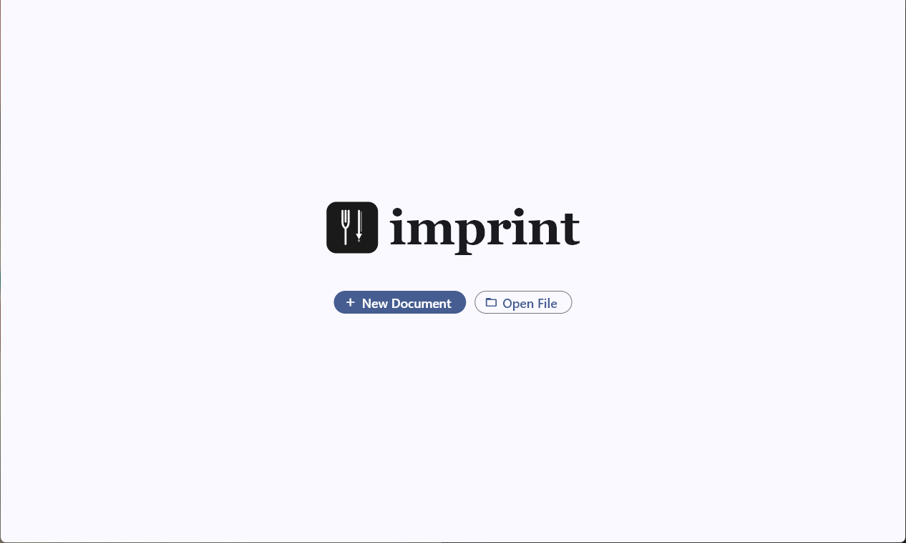
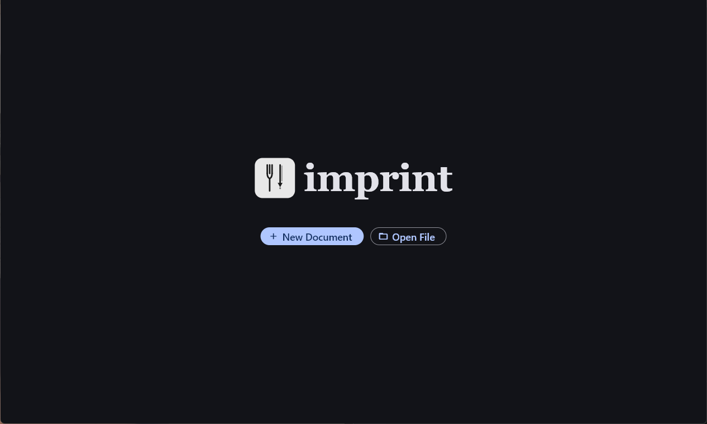
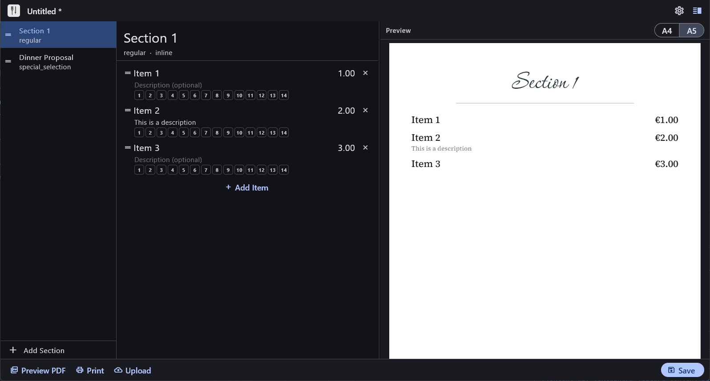
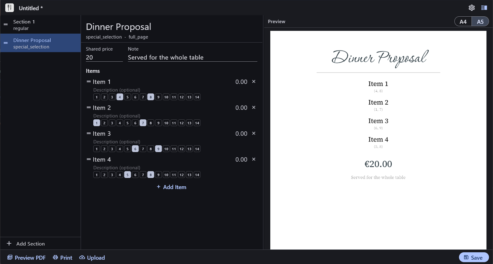
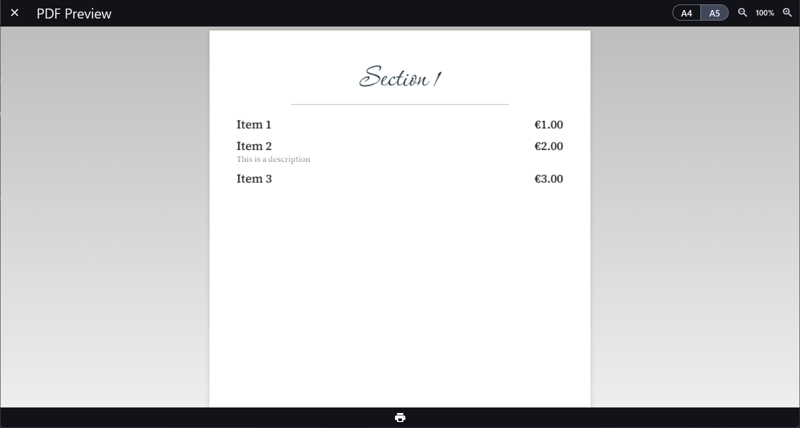
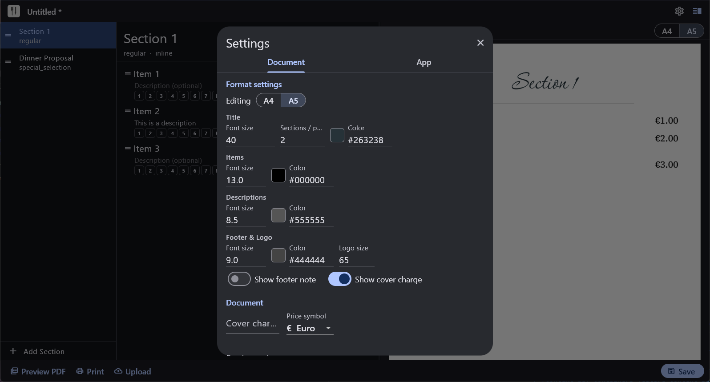

<div align="center">

<picture>
  <source media="(prefers-color-scheme: light)" srcset="assets/logo/imprint_logo_light.png">
  <source media="(prefers-color-scheme: dark)" srcset="assets/logo/imprint_logo_dark.png">
  
</picture>

<br/>
<br/>

**A structured menu editor for restaurants — define your template once, fill content at runtime, publish everywhere.**

<br/>

[](https://flutter.dev)
[](#)
[](https://www.gnu.org/licenses/agpl-3.0)
[](CONTRIBUTING.md)
[](#)

</div>

---

## What is imprint?

**imprint** (from *imposta* + *print*) is a desktop tool built for restaurants, cafés, and anyone who needs to maintain a menu without becoming a designer.

You define your menu layout once — as a template in code — and from that point on, all you do is type text. imprint handles the formatting, exports to print-ready PDF (A4, A5, and more), sends directly to your printer, and can upload the finished document straight to any S3-compatible storage.

No InDesign. No Word. No fighting with spacing every time a dish changes.

### Key features

- **Template-driven layout** — design your menu structure once in code; content is filled at runtime
- **Distraction-free editing** — a clean UI where you only ever write text, never touch formatting
- **PDF export** — A4, A5, and custom page sizes, print-ready out of the box
- **Direct print** — send to any connected printer without leaving the app
- **S3 upload** — push your finished menu to any S3-compatible service (AWS, Backblaze, MinIO, etc.)
- **Dark & light mode** — full system theme support

---

## Screenshots

<div align="center">

**Home screen**


&nbsp;


<br/><br/>

**Editor with live preview**


&nbsp;


<br/><br/>

**PDF preview & settings**


&nbsp;


</div>

---

## Getting started

### Prerequisites

- [Flutter SDK](https://docs.flutter.dev/get-started/install) — stable channel, 3.x or later
- A desktop target configured for your platform ([macOS](https://docs.flutter.dev/desktop#macos), [Windows](https://docs.flutter.dev/desktop#windows), [Linux](https://docs.flutter.dev/desktop#linux))

### Installation

```bash
# Clone the repository
git clone https://github.com/your-username/imprint.git
cd imprint

# Fetch dependencies
flutter pub get

# Run on your platform
flutter run -d macos    # or windows / linux
```

### Building a release binary

```bash
flutter build macos     # or windows / linux
```

The output binary will be in `build/macos/Build/Products/Release/` (adjust path per platform).

## Contributing

Contributions are very welcome! imprint is an early-stage open-source project and there is plenty of low-hanging fruit.

1. Fork the repository
2. Create a feature branch (`git checkout -b feat/my-feature`)
3. Commit your changes (`git commit -m 'feat: add my feature'`)
4. Push and open a Pull Request

Please read [`CONTRIBUTING.md`](CONTRIBUTING.md) before submitting. For larger changes, open an issue first so we can discuss the approach.

---

## License

imprint is licensed under the **GNU Affero General Public License v3.0 (AGPL-3.0)**.

This means you are free to use, study, and modify imprint, but any modified version you distribute — including running it as a network service — must also be released under the same license. You cannot take this code, make it proprietary, and sell it.

See [`LICENSE`](LICENSE.md) for the full terms.

---

<div align="center">
  <sub>Built with Flutter · Made for the people who feed us</sub>
</div>
